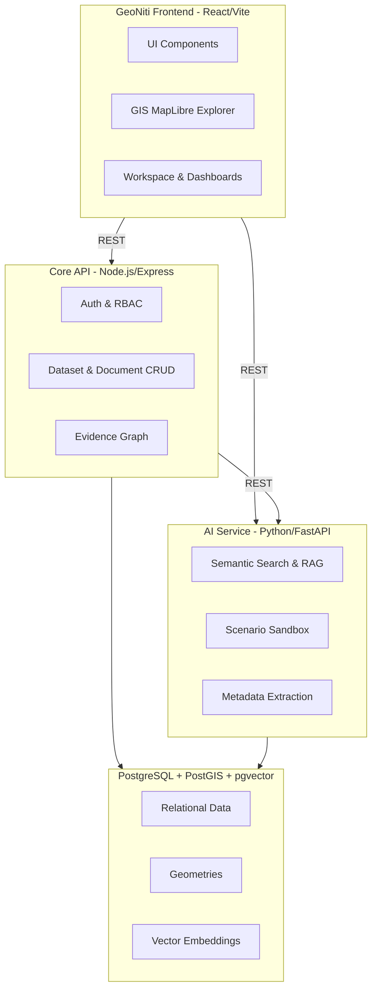

# GeoNiti (BhuNiti) - Spatial Intelligence for Land Policy

GeoNiti is a spatial intelligence platform designed for the government to power data-driven land policy. It integrates unstructured documents (policies, research papers, legal cases), structured datasets, and geospatial layers into a unified knowledge graph. Using advanced AI (Retrieval-Augmented Generation) and spatial analytics, GeoNiti enables policymakers to move from reactive record-keeping to proactive scenario modeling.

## Architecture



## Setup in 5 Commands

To run the platform locally with Docker:

```bash
# 1. Copy the environment template
cp .env.example .env

# 2. Build and start the infrastructure (DB, API, AI)
docker-compose up -d --build

# 3. Run database migrations
docker-compose exec core-api npm run db:migrate

# 4. Seed the database with illustrative demo data
docker-compose exec core-api npm run db:seed

# 5. Start the frontend development server
cd frontend && npm install && npm run dev
```
*(Access the frontend at http://localhost:5173)*

## Demo Credentials

You can log in with any of the seeded roles to experience different levels of access and functionality:

- **Official (Recommended)**: `official@gov.in` / `password`
- **System Admin**: `admin@gov.in` / `password`
- **Policy Analyst**: `analyst@gov.in` / `password`
- **Data Administrator**: `data@gov.in` / `password`

## Demo Script
Please see [docs/DEMO_SCRIPT.md](./docs/DEMO_SCRIPT.md) for the end-to-end narrative to present to stakeholders. For anticipated questions, see [docs/JUDGE_QA.md](./docs/JUDGE_QA.md).

## Screenshots
*(Placeholders for screenshots)*
- `docs/screenshots/dashboard.png`
- `docs/screenshots/gis_explorer.png`
- `docs/screenshots/assistant_rag.png`
- `docs/screenshots/scenario_sandbox.png`

## Limitations and Roadmap
While this demo demonstrates the platform's capabilities with seeded, illustrative data, a real-world deployment requires:

1. **Formal Data-Sharing Agreements**: Establishing legal frameworks to access restricted government datasets (e.g., land records, tax data) across different ministries.
2. **Real Datasets**: Replacing seeded examples with live integrations via secure APIs or batch ingestion pipelines.
3. **Model Validation**: The Scenario Sandbox currently uses illustrative heuristics. Real deployment requires integrating established econometric or system-dynamics models validated against historical holdout data.
4. **Security Review**: Comprehensive penetration testing and independent security audits to protect sensitive internal documents.
5. **Fine-Tuned Embeddings**: Enhancing the RAG pipeline by fine-tuning embedding models on Indian legal and administrative corpora for higher accuracy.
