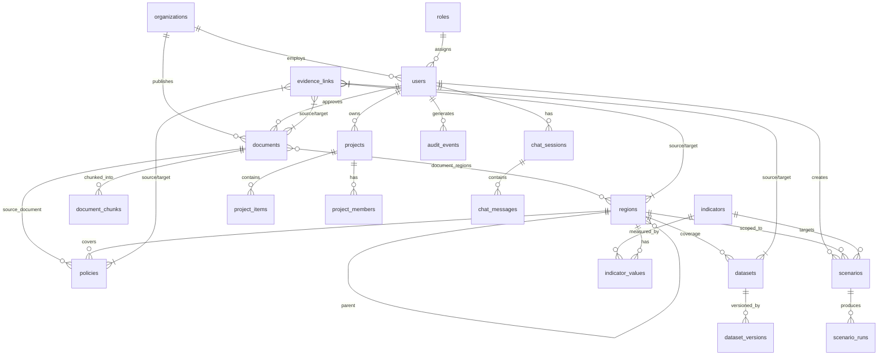

# Database Schema

**Database:** PostgreSQL 16 + PostGIS 3.4 + pgvector + pg_trgm + pgcrypto  
**Conventions:** UUID PKs (`gen_random_uuid()`), `created_at`/`updated_at` timestamptz, snake_case.  
**Migration runner:** `npm run migrate` (core-api) — tracks applied files in `schema_migrations`.

---

## Tables

| Table | Key Columns | Notes |
|---|---|---|
| `organizations` | id, name, type | type: ministry\|state_dept\|university\|research_org\|ngo\|industry |
| `roles` | id, name (unique) | Seeded: researcher, policy_analyst, govt_official, data_admin, system_admin, public |
| `users` | id, email (unique), password_hash, role_id, organization_id, is_active | FK → roles, organizations |
| `regions` | id, code (unique), name, level, parent_id, geom (MultiPolygon/4326), centroid, population, area_km2 | GIST idx on geom & centroid |
| `documents` | id, type, title, abstract, authors[], org, year, status, visibility, is_illustrative, keywords[], topics[] | GIN on keywords/topics; trgm on title |
| `document_regions` | document_id, region_id | Junction (PK composite) |
| `document_chunks` | id, document_id, chunk_index, content, token_count, embedding vector(384) | HNSW cosine idx |
| `v_public_documents` | (view) | `status=approved AND visibility=public` — ALL search/RAG must use this |
| `policies` | id, name, level, start_year, end_year, status, region_id, source_document_id | |
| `datasets` | id, title, org, coverage_region_id, time_start/end, visibility, status, is_illustrative, current_version_id | |
| `dataset_versions` | id, dataset_id, version (unique per dataset), file_path, checksum, row_count | |
| `geo_layers` | id, key (unique), name, category, source, is_illustrative, style jsonb | category: land_use\|infrastructure\|climate\|socio_economic\|disputes |
| `indicators` | id, key (unique), name, unit, category, higher_is_better, source_dataset_id | |
| `indicator_values` | region_id, indicator_id, year → unique triplet, value | |
| `projects` | id, name, owner_id, is_public | |
| `project_members` | project_id, user_id, role (owner\|editor\|viewer) | |
| `project_items` | id, project_id, item_type, item_id, note, position | item_type: document\|dataset\|map\|analysis\|scenario\|note |
| `saved_searches` | id, user_id, name, query, filters jsonb | |
| `analyses` | id, user_id, project_id, type, params jsonb, result jsonb | |
| `scenarios` | id, name, region_id, target_indicator_id, parameters jsonb, created_by | |
| `scenario_runs` | id, scenario_id, user_id, inputs, baseline, projection, band, metrics, assumptions jsonb, explanation, model_card jsonb | Outputs labelled "scenario estimate" |
| `evidence_links` | id, source_type, source_id, target_type, target_id, relation, weight | Idx on both sides |
| `annotations` | id, user_id, entity_type, entity_id, content | |
| `chat_sessions` | id, user_id, project_id, title | |
| `chat_messages` | id, session_id, role (user\|assistant\|system), content, citations jsonb, grounded bool | |
| `challenges` | id, type, title, status, deadline, org_id, created_by | type: hackathon\|grant\|pilot\|competition |
| `audit_events` | id, actor_id, action, entity_type, entity_id, meta jsonb, ip, created_at | Append-only |
| `notifications` | id, user_id, type, title, body, is_read, meta jsonb | Idx on unread |

---

## ER Diagram (main relations)

